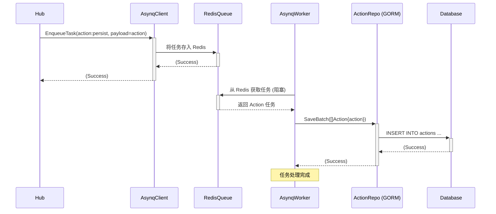

# Collaborative Real-time Blackboard (协作白板后端服务)

## 简介

这是一个基于 Go 语言实现的轻量级、可扩展的多人实时协作白板后端服务。它支持多用户在不同的房间内进行实时的绘制操作同步，并提供了用户认证、状态持久化和缓存等功能。项目采用分层架构设计，旨在实现高内聚、低耦合，并为未来的功能扩展和多实例部署打下基础。

## 核心功能

*   **用户认证:** 提供用户注册和登录功能，使用 JWT (JSON Web Token) 进行会话管理。
*   **多房间协作:** 支持创建和加入多个独立的协作房间，房间之间数据隔离。
*   **实时同步:**
    *   使用 WebSocket 实现客户端与服务器之间的低延迟双向通信。
    *   通过 Redis Pub/Sub 实现 Action（用户操作）在同一房间内的高效实时广播（支持多实例部署）。
*   **状态管理:**
    *   使用 Redis Hash 存储每个房间当前的实时白板状态，实现快速读写。
    *   新用户加入时，提供基于 Redis 缓存或数据库持久化的快照 (Snapshot) 以快速同步状态。
*   **持久化:**
    *   用户信息、房间信息、快照数据使用 GORM 持久化到关系型数据库 (请替换为你使用的数据库，如 MySQL/PostgreSQL)。
    *   用户操作记录 (Action) 通过 Asynq 任务队列进行**异步、可靠**地持久化到数据库，解耦实时路径。
*   **基础功能:**
    *   API 速率限制 (基于 Redis)。
    *   (待实现) WebSocket 心跳检测与无效连接清理。
    *   (待实现) 后台定时生成快照任务。

## 技术栈

*   **语言:** Go (Golang)
*   **Web 框架:** Gin (`github.com/gin-gonic/gin`)
*   **数据库 ORM:** GORM (`gorm.io/gorm`)
*   **数据库:** MySQL 
*   **缓存/状态存储/消息:** Redis (`github.com/go-redis/redis/v8`) - 使用了 String, Hash, List, Pub/Sub
*   **后台任务队列:** Asynq (`github.com/hibiken/asynq`) - 基于 Redis
*   **WebSocket:** Gorilla WebSocket (`github.com/gorilla/websocket`)
*   **认证:** JWT (`github.com/golang-jwt/jwt/v4`)
*   **配置:** Godotenv (`github.com/joho/godotenv`)
*   **日志:** Logrus (`github.com/sirupsen/logrus`)
*   **测试:** Testify (`github.com/stretchr/testify`) - mock, assert, require

## 架构设计

本项目采用清晰的分层架构，旨在分离关注点，提高代码的可维护性、可测试性和可扩展性。

**主要分层:**

*   **CMD (`cmd/server`):** 应用程序入口，负责启动和优雅关闭。
*   **Bootstrap (`internal/bootstrap`):** 负责加载配置、初始化所有组件（DB, Redis, Asynq 等）、进行依赖注入、设置路由和中间件，并管理应用的生命周期。
*   **Handler (`internal/handler`):** 处理外部交互。
    *   `http`: 处理 HTTP API 请求（如用户认证、房间管理），验证输入，调用 Service，返回响应。
    *   `websocket`: 处理 WebSocket 连接升级请求，创建客户端实例并注册到 Hub。
*   **Middleware (`internal/middleware`):** 提供通用的 HTTP 请求处理逻辑（认证、速率限制、CORS 等）。
*   **Hub (`internal/hub`):** WebSocket 连接的核心协调器。管理客户端连接和房间分组，接收客户端消息，调用 Service 处理，并**通过 Redis Pub/Sub 触发广播**（由 Hub 内的订阅者处理分发）。管理房间的 Pub/Sub 订阅生命周期。
*   **Service (`internal/service`):** 包含核心业务逻辑，编排操作流程，处理业务规则，依赖 Repository 接口。
*   **Repository (`internal/repository`):** 定义数据访问的抽象接口和通用错误。
*   **Infrastructure (`internal/infra`):** 包含与外部服务的具体交互实现。
    *   `persistence/gorm`: GORM 实现，负责与数据库交互。
    *   `state/redis`: Redis 实现，负责实时状态、缓存、计数器、版本、历史记录、Pub/Sub 发布。
    *   `setup`: 基础设施初始化（DB, Redis 连接，迁移）。
    *   `worker`: Asynq Worker 实现，负责处理后台任务（如 Action 持久化）。
    *   `config`: (如果使用 Viper 等) 配置加载实现。
*   **Domain (`internal/domain`):** 定义核心领域模型（User, Room, Action, Snapshot, BoardState）。
*   **Tasks (`internal/tasks`):** 定义 Asynq 任务类型和 Payload。

**核心流程图 (Mermaid):**

```mermaid
sequenceDiagram
    participant Client A
    participant WS Handler
    participant Hub
    participant CollabService
    participant StateRepo (Redis)
    participant AsynqClient
    participant RedisPubSub
    participant Hub Subscriber (Room X)
    participant Client B

    Client A->>+WS Handler: 发送 Action (WebSocket)
    Note over WS Handler,Client A: Client.readPump 读取消息
    WS Handler->>+Hub: QueueMessage(type="action", data=RawData)
    Hub->>+CollabService: ProcessIncomingAction(data) (异步)
    CollabService->>+StateRepo (Redis): IncrementVersion()
    StateRepo (Redis)-->>-CollabService: newVersion
    CollabService->>+StateRepo (Redis): ApplyActionToState(action)
    StateRepo (Redis)-->>-CollabService: (Success)
    CollabService->>+StateRepo (Redis): PushActionToHistory(action)
    StateRepo (Redis)-->>-CollabService: (Success)
    CollabService->>+StateRepo (Redis): IncrementOpCount()
    StateRepo (Redis)-->>-CollabService: (Success)
    CollabService->>+StateRepo (Redis): PublishAction(action)
    StateRepo (Redis)-->>RedisPubSub: PUBLISH channel:room_X (action)
    CollabService-->>-Hub: return processedAction, shouldBroadcast=true
    Hub->>+AsynqClient: EnqueueTask(action:persist, payload=action) (异步)
    Note right of Hub: 持久化任务入队
    AsynqClient-->>-Hub: (Success)

    RedisPubSub->>+Hub Subscriber (Room X): 收到消息 (action)
    Note over Hub Subscriber (Room X): roomSubscribeLoop 运行中
    Hub Subscriber (Room X)->>Client B: client.send <- action (放入通道)
    Note over Client B,Hub Subscriber (Room X): writePump 将数据发送给 Client B
    Client B->>-Client B: 更新本地白板
```



**关键组件职责:**

*   **CMD/Bootstrap:** 应用入口、配置加载、依赖注入、组件组装、生命周期管理。
*   **Handler:** 处理 HTTP/WebSocket 请求，验证输入，调用 Service/Hub。
*   **Middleware:** 通用请求处理逻辑（认证、限流、CORS）。
*   **Hub:** WebSocket 连接协调器，管理客户端和房间，处理连接事件，通过 PubSub 协调广播。
*   **Service:** 核心业务逻辑，编排操作，依赖 Repository 接口。
*   **Repository (Interface):** 数据访问抽象契约。
*   **Infrastructure:** 数据库、Redis、Asynq 等具体实现，实现 Repository 接口。
*   **Domain:** 核心数据模型。
*   **Tasks/Worker:** 后台异步任务定义与处理。

**设计亮点:**

*   清晰的分层架构，职责分离。
*   面向接口编程，依赖倒置，易于测试和替换实现。
*   使用 Redis 高效处理实时状态和广播 (Pub/Sub)。
*   通过 Asynq 实现 Action 持久化的异步处理，解耦实时路径，提高可靠性。
*   为多实例部署和水平扩展提供了基础 (通过 Redis Pub/Sub)。
*   包含优雅关闭逻辑，确保服务稳定退出。

## 如何运行

**先决条件:**

*   Go (版本 >= 1.18)
*   Docker 和 Docker Compose (推荐)
*   Make (可选)

**配置:**

1.  在项目根目录创建 `.env` 文件。
2.  根据你的环境设置必要的环境变量，至少包括：
    ```dotenv
    # 数据库配置 (以 MySQL 为例)
    DB_USER=your_db_user
    DB_PASSWORD=your_db_password
    DB_HOST=localhost # 或 Docker 服务名, e.g., mysql
    DB_PORT=3306      # 或 Docker 映射端口
    DB_NAME=blackboard_db

    # Redis 配置
    REDIS_ADDR=localhost:6379 # 或 Docker 服务名:端口, e.g., redis:6379
    REDIS_PASSWORD= # 留空如果没有密码
    REDIS_DB=0

    # JWT 配置
    JWT_SECRET=replace_with_a_very_strong_secret_key # !!! 必须设置一个强密钥 !!!

    # 服务器配置
    SERVER_PORT=8080
    APP_ENV=development # 或 production

    # (可选) 其他配置
    LOG_LEVEL=debug
    REDIS_KEY_PREFIX=bb:
    CORS_ALLOWED_ORIGIN=http://localhost:3000 # 根据你的前端地址修改
    ```
    *(建议创建一个 `.env.example` 文件作为模板)*

**启动依赖 (使用 Docker Compose - 推荐):**

```bash
docker-compose up -d # 启动数据库和 Redis
```
(你需要提供一个 docker-compose.yml 文件，包含 MySQL/PostgreSQL 和 Redis 服务)

**安装 Go 依赖:**

```bash
go mod tidy
```

**数据库迁移**
数据库迁移会在应用首次启动时自动执行

**启动服务:**

```bash
go run cmd/server/main.go # 直接运行
```
服务将在配置的端口 (默认 8080) 启动。

## API 接口 (示例)

*   **用户注册:** `POST /api/auth/register`
    *   **Request Body:**
        ```json
        {
          "username": "testuser",
          "password": "password123",
          "email": "test@example.com" 
        }
        ```
    *   **Response (Success 200):**
        ```json
        {
          "message": "User registered successfully",
          "user_id": 1 
        }
        ```
    *   **Response (Error 400 - Bad Request):** (例如用户名已存在或输入无效)
        ```json
        {
          "error": "registration failed: username or email already exists" 
          // 或 "Invalid input: details..."
        }
        ```

*   **用户登录:** `POST /api/auth/login`
    *   **Request Body:**
        ```json
        {
          "username": "testuser", 
          "password": "password123"
        }
        ```
    *   **Response (Success 200):**
        ```json
        {
          "message": "Login successful",
          "token": "your_jwt_token_here" 
        }
        ```
    *   **Response (Error 401 - Unauthorized):** (用户名或密码错误)
        ```json
        {
          "error": "authentication failed" 
        }
        ```

*   **创建房间:** `POST /api/rooms`
    *   **Authentication:** 需要在请求头中添加 `Authorization: Bearer your_jwt_token_here`。
    *   **Request Body:** (空)
    *   **Response (Success 200):**
        ```json
        {
          "message": "Room created successfully",
          "room_id": 123, 
          "invite_code": "ABCDEF" 
        }
        ```
    *   **Response (Error 401 - Unauthorized):** (Token 无效或缺失)
        ```json
        {
          "error": "Invalid or expired token" // 或 "Authorization header is required"
        }
        ```
    *   **Response (Error 500 - Internal Server Error):** (例如邀请码生成失败)
        ```json
        {
          "error": "Failed to create room"
        }
        ```

*   **加入房间:** `POST /api/rooms/join`
    *   **Authentication:** 需要在请求头中添加 `Authorization: Bearer your_jwt_token_here`。
    *   **Request Body:**
        ```json
        {
          "invite_code": "ABCDEF"
        }
        ```
    *   **Response (Success 200):**
        ```json
        {
          "message": "Joined room successfully",
          "room_id": 123 
        }
        ```
    *   **Response (Error 401 - Unauthorized):** (Token 无效或缺失)
        ```json
        {
          "error": "Invalid or expired token" 
        }
        ```
    *   **Response (Error 404 - Not Found):** (邀请码无效或房间不存在)
        ```json
        {
          "error": "invalid or expired invite code" // 或 "room not found"
        }
        ```
    *   **Response (Error 400 - Bad Request):** (请求体格式错误)
        ```json
        {
          "error": "Invalid input: invite_code is required"
        }
        ```


## WebSocket 协议 (简要)

*   **连接 URL:** `ws://<host>:<port>/ws/room/{roomId}`
    *   **认证:** 需要在发起连接的 HTTP 请求头中包含有效的 `Authorization: Bearer <your_jwt_token>`。WebSocket 升级成功后，连接即被认为是已认证的。
    *   `{roomId}` 是路径参数，代表要加入的房间 ID。

*   **消息格式:** 客户端与服务器之间通过 WebSocket 传输的消息**推荐**使用 JSON 格式。

*   **客户端 -> 服务器 (Client to Server):**
    *   **主要消息类型:** 用户操作 (Action)。客户端应将用户的绘图或擦除操作构造成类似以下的 JSON 格式发送给服务器：
        ```json
        // 画点 (包含颜色)
        {
          "x": 15,
          "y": 30,
          "color": "#0000FF" // 蓝色的点
        }
        ```
        ```json
        // 擦除 (color 为空字符串或 null)
        {
          "x": 15,
          "y": 30,
          "color": ""
        }
        ```
    *   **(未来可能需要):** 客户端准备好接收快照的信号（如果不由服务器主动推送）、心跳消息 (Pong 响应 Ping) 等。

*   **服务器 -> 客户端 (Server to Client):**
    *   服务器会推送多种类型的 JSON 消息给客户端：
    *   **其他用户的操作 (Action):** 当房间内有其他用户执行操作时，服务器会将处理后的 `Action` 对象（通常已包含 `UserID`, `Version`, `Timestamp` 等元数据）序列化为 JSON 推送给其他客户端。
        ```json
        {
          "ID": 105,                // Action 记录的数据库 ID (可选)
          "RoomID": 123,
          "UserID": 8,               // 执行操作的用户 ID
          "ActionType": "draw",      // 操作类型 ("draw" 或 "erase")
          "Data": "{\"x\":22,\"y\":45,\"color\":\"#FFC0CB\"}", // 序列化后的 DrawData JSON 字符串
          "Timestamp": "2023-10-27T11:05:00Z", // 操作发生时间 (UTC)
          "Version": 61,              // 此操作对应的版本号
          "CreatedAt": "2023-10-27T11:05:01Z" // 记录创建时间 (可选)
        }
        ```
    *   **初始状态快照 (Snapshot):** 当客户端成功连接并注册到房间后，服务器会推送当前房间的快照。
        ```json
        {
          "type": "snapshot",         // 消息类型标识
          "version": 50,              // 快照对应的最新版本号
          "state": {                  // 当前完整的 BoardState
            "10:20": "#FF0000",
            "15:25": "#00FF00",
            "22:45": "#FFC0CB"
            // ... 可能包含很多点 ...
          }
        }
        ```
    *   **错误消息 (Error):** 当服务器在处理客户端的某个请求或内部发生错误时，可能会推送错误消息。
        ```json
        {
          "type": "error",            // 消息类型标识
          "message": "Invalid action format received." // 具体的错误描述
        }
        ```
    *   **(未来可能需要):** 在线用户列表更新通知、房间状态变更通知等。

## 未来计划 / TODO

本项目目前实现了核心的实时协作功能和基础架构，但仍有许多可以改进和扩展的方向：

*   **[核心功能完善] 实现 WebSocket 客户端心跳检测与清理:** 在 `internal/hub/hub.go` 中添加基于 Ping/Pong 的机制，自动检测并移除无响应的客户端连接，提高服务的稳定性。
*   **[核心功能完善] 实现后台定时快照生成任务:** 利用 Asynq 的定时任务功能 (`client.EnqueuePeriodicTask`) 或类似机制，定期触发 `SnapshotService` 为活跃房间生成快照，确保快照的时效性。
*   **[核心功能完善] 实现更健壮的操作转换 (OT) 或 CRDT:** 当前的冲突处理非常基础 (或缺失)。研究并引入更成熟的 OT 算法或适用于图形协作的 CRDT，以更优雅地处理并发编辑冲突，提升用户体验。
*   **[测试与质量] 添加完整的单元测试和集成测试覆盖:** 为 Service, Repository, Hub 等关键组件编写全面的测试用例，确保代码质量和方便后续重构。
*   **[功能扩展] 添加房间权限控制:** 例如，区分房主和普通成员，只有房主可以清屏、踢人等。
*   **[功能扩展] 支持更多绘图工具:** 如直线、矩形、圆形、文本输入框等。这需要扩展 `domain.Action` 的 `ActionType` 和 `Data` 结构，并更新 `CollaborationService` 和前端的逻辑。
*   **[功能扩展] 实现撤销/重做 (Undo/Redo):** 可以基于 Action 历史 (Redis List) 或其他状态管理策略来实现。
*   **[性能优化] 优化数据库和 Redis 性能:** 对于高负载场景，分析并优化慢查询、减少 Redis 操作次数、评估更高效的数据结构等。例如，对于超大画板，考虑 `HSCAN` 替代 `HGETALL`。
*   **[文档与易用性] 提供 API 文档:** 使用 Swagger/OpenAPI 等工具生成交互式 API 文档。
*   **[部署与运维] 容器化部署优化:** 提供更完善的 Dockerfile 和 Docker Compose 配置，方便部署。添加健康检查端点。考虑生产环境的日志收集和监控方案。
*   **[错误处理] 细化错误处理:** 向客户端返回更具体的错误信息，完善服务端的错误重试和告警机制。